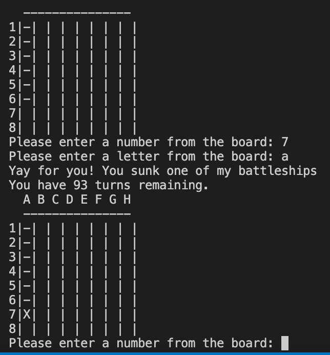
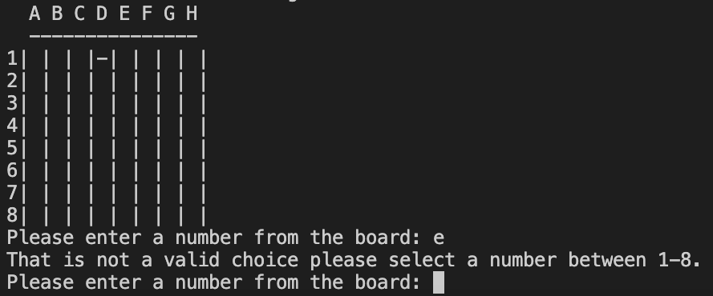

# Saras Battleships

Battleship is a Python Terminal game for a single player. The user can play the computer to try and sink their battleships in a certain number of times.

## How the game is played

The user starts the game by choosing a place on the computers hidden board to try and hit a randomly placed ship. There are five single ships placed on the board. You have ten times to try and hit the ships, and if you hit all five -you win the game!

## Features

  - Random game board
  - User plays computer
  - The game accepts user input
  - The game counts down number of tries

  

  - Input validation and checks for errors             
  - The user must choose numbers or letters valid and cannot leave a blank space.

    

### Features Left to Implement

- A choice of board size.
- An ability to choose size of ships.
- An ability for the computer to sink ships on the users board.

## Testing

- I have tested the game in GitPods terminal, checked and corrected any errors
- I have run my code through a PEP8 linter without problems.

## Bugs

- Incorrect row/column input was accepted.
Validation was originally done by checking the input was contained in a string. The string contained all possible values but this allowed for consecutive characters to be validated (ie, 12)
To resolve this issue, each valid value has been added into a tuple as a separate item.
-  If no input was provided for row/column, the program would error and close.
The tutorial had a call to a class method that required a parameter and this was not being passed.
The method parameter was not required at any time and so the method was modified to a staticmethod instead, allowing it to be called without the class being instantiated.

- No bugs left unsolved.

## Deployment
I have used a mock terminal by Heroku to deploy my project.

## Credits
A good friend on Slack who has helped me sort out bugs.
Code Institute for deployment terminal.
GitPod for writing my code.